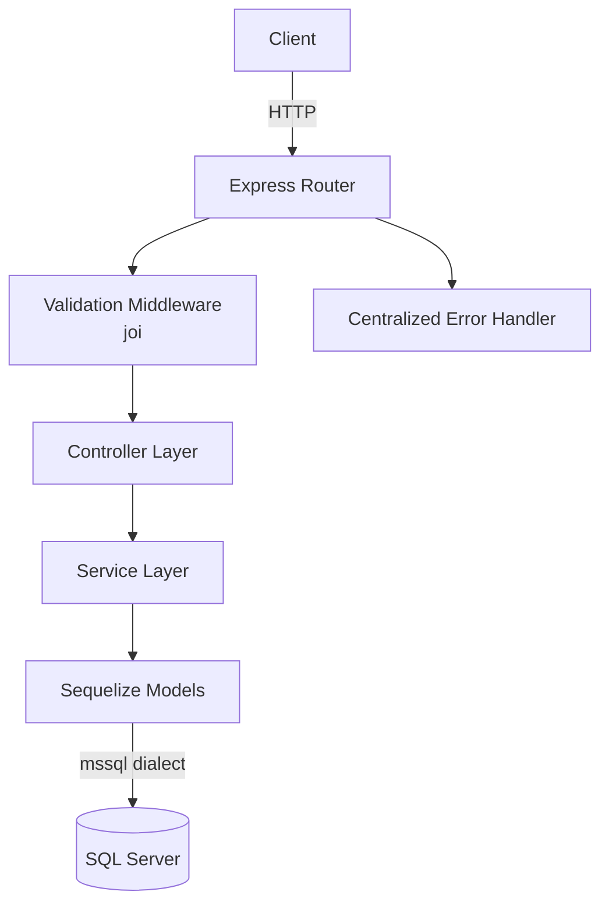

# Design Document

## Overview

API REST en Node.js que expone operaciones CRUD y de consulta sobre tareas, conectada a SQL Server mediante Sequelize. El proyecto sigue una arquitectura en capas (rutas → controladores → servicios → repositorios/modelos) para mantener separación de responsabilidades y facilitar las pruebas.

---

## Architecture



Capas:
- **Router** – define rutas y aplica middlewares de validación antes de delegar al controlador.
- **Controller** – orquesta la petición/respuesta HTTP, sin lógica de negocio.
- **Service** – contiene la lógica de negocio (validaciones de dominio, cálculo del resumen, registro de historial).
- **Model** – modelos Sequelize que mapean las tablas de SQL Server.
- **Error Handler** – middleware Express de 4 argumentos que captura todos los errores y devuelve JSON uniforme.

---

## Components and Interfaces

### Directory Structure

```
src/
  config/
    database.js        # Instancia Sequelize + validación de env vars
    env.js             # Lectura y validación de variables de entorno
  models/
    Tarea.js           # Modelo Sequelize para la tabla Tareas
    HistorialEstado.js # Modelo Sequelize para la tabla HistorialEstados
    index.js           # Asociaciones entre modelos
  validators/
    tareaValidator.js  # Esquemas joi para cada endpoint
  controllers/
    tareasController.js
  services/
    tareasService.js
  routes/
    tareas.js
  middlewares/
    errorHandler.js
  app.js               # Configuración Express (rutas, middlewares)
  server.js            # Punto de entrada, inicia el servidor
tests/
  integration/
    resumen.test.js    # Test de integración para GET /tareas/resumen
.env.example
```

### Endpoints

| Método | Ruta | Descripción |
|--------|------|-------------|
| POST | /tareas | Crea una tarea |
| GET | /tareas | Lista tareas con filtros y paginación |
| PATCH | /tareas/:id/estado | Cambia el estado de una tarea |
| GET | /tareas/resumen | Resumen estadístico por responsable |

### Request / Response Contracts

**POST /tareas**
```json
// Request body
{
  "titulo": "string (requerido)",
  "descripcion": "string (opcional)",
  "prioridad": "BAJA | MEDIA | ALTA",
  "idResponsable": "number (requerido)",
  "fechaLimite": "ISO 8601 date string, futuro"
}
// Response 201
{ "id": 1, "titulo": "...", "estado": "PENDIENTE", ... }
```

**GET /tareas**
```json
// Query params: estado, responsable, desde, hasta, page (default 1), limit (default 10)
// Response 200
{
  "data": [ { ...tarea } ],
  "meta": { "total": 50, "page": 1, "limit": 10 }
}
```

**PATCH /tareas/:id/estado**
```json
// Request body
{ "estado": "EN_PROGRESO | COMPLETADA | CANCELADA | PENDIENTE" }
// Response 200
{ "id": 1, "estado": "EN_PROGRESO", ... }
```

**GET /tareas/resumen?responsable=:id**
```json
// Response 200
{
  "responsable": 5,
  "resumen": {
    "PENDIENTE": 3,
    "EN_PROGRESO": 1,
    "COMPLETADA": 2,
    "CANCELADA": 0
  },
  "promediosDiasCompletadas": 4.5
}
```

---

## Data Models

### Tabla: Tareas

| Columna | Tipo | Notas |
|---------|------|-------|
| id | INT IDENTITY PK | |
| titulo | NVARCHAR(255) | NOT NULL |
| descripcion | NVARCHAR(MAX) | NULL |
| prioridad | NVARCHAR(10) | CHECK IN ('BAJA','MEDIA','ALTA') |
| idResponsable | INT | NOT NULL |
| fechaLimite | DATE | NOT NULL |
| estado | NVARCHAR(20) | DEFAULT 'PENDIENTE' |
| createdAt | DATETIME2 | Sequelize timestamps |
| updatedAt | DATETIME2 | Sequelize timestamps |

### Tabla: HistorialEstados

| Columna | Tipo | Notas |
|---------|------|-------|
| id | INT IDENTITY PK | |
| tareaId | INT | FK → Tareas.id |
| estadoAnterior | NVARCHAR(20) | |
| estadoNuevo | NVARCHAR(20) | |
| fechaCambio | DATETIME2 | DEFAULT GETDATE() |

### Sequelize Models

```js
// Tarea.js
Tarea.init({
  titulo: { type: DataTypes.STRING, allowNull: false },
  descripcion: { type: DataTypes.TEXT },
  prioridad: { type: DataTypes.ENUM('BAJA','MEDIA','ALTA'), allowNull: false },
  idResponsable: { type: DataTypes.INTEGER, allowNull: false },
  fechaLimite: { type: DataTypes.DATEONLY, allowNull: false },
  estado: {
    type: DataTypes.ENUM('PENDIENTE','EN_PROGRESO','COMPLETADA','CANCELADA'),
    defaultValue: 'PENDIENTE'
  }
}, { sequelize, modelName: 'Tarea' });

// HistorialEstado.js
HistorialEstado.init({
  tareaId: { type: DataTypes.INTEGER, allowNull: false },
  estadoAnterior: { type: DataTypes.STRING },
  estadoNuevo: { type: DataTypes.STRING, allowNull: false },
  fechaCambio: { type: DataTypes.DATE, defaultValue: DataTypes.NOW }
}, { sequelize, modelName: 'HistorialEstado', timestamps: false });
```

---

## Error Handling

Todos los errores se propagan con `next(err)` hasta el middleware centralizado en `middlewares/errorHandler.js`.

```js
// Estructura de error uniforme
{
  "error": "Mensaje descriptivo",
  "details": [ ... ]  // solo en errores de validación
}
```

| Escenario | HTTP Status |
|-----------|-------------|
| Validación joi fallida | 422 |
| Recurso no encontrado | 404 |
| Error interno / no controlado | 500 |

Se usa una clase `AppError` para errores de dominio con código HTTP configurable. Los stack traces nunca se exponen en producción (`NODE_ENV !== 'development'`).

---

## Testing Strategy

- **Framework**: Jest + Supertest
- **Scope**: Un archivo de integración `tests/integration/resumen.test.js`
- **Estrategia**: Se usa una base de datos de prueba (variable `DB_CONNECTION_STRING` apuntando a una BD de test) o se mockea Sequelize con `jest.mock` para aislar la lógica.
- **Casos cubiertos**:
  1. GET /tareas/resumen con `responsable` válido → HTTP 200 + estructura correcta
  2. GET /tareas/resumen sin `responsable` → HTTP 422
  3. GET /tareas/resumen con `responsable` sin tareas → HTTP 200 con conteos en cero

### Decisiones de diseño

- **Sequelize sobre query raw**: facilita las migraciones y el mapeo de modelos, aunque para el resumen se usa `sequelize.literal` para el cálculo de promedio de días directamente en SQL por eficiencia.
- **joi para validación**: librería madura, permite esquemas reutilizables y mensajes de error descriptivos.
- **Ruta `/tareas/resumen` antes de `/tareas/:id`**: Express evalúa rutas en orden de registro; `resumen` debe registrarse primero para evitar que `:id` capture la palabra "resumen".
- **Variables de entorno validadas al inicio**: la app falla rápido si falta `DB_CONNECTION_STRING`, evitando errores silenciosos en runtime.
